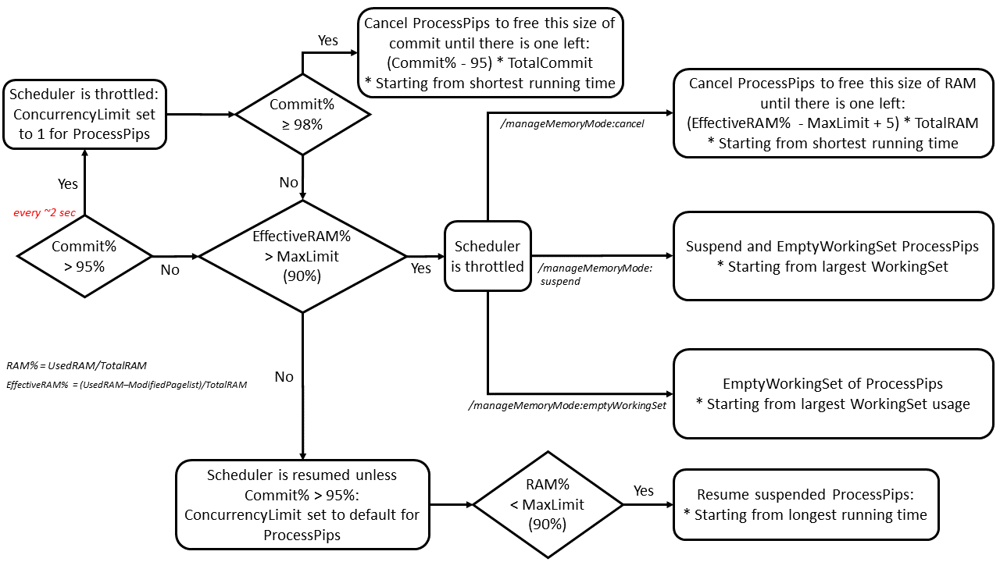

#  Resource usage configuration

BuildXL has a few options to configure how many resources your build consumes on your machine. By default it attempts to perform the build as fast as possible. But this can cause other tasks on the machine to become unresponsive. There may also be some machine configurations for which the default settings need to be tuned to achieve the desired result.

## Process Concurrency Limit
The most powerful setting to modify is the maximum number of child process pips BuildXL will launch at a time. This can be configured with one of two options:

    /maxProc:<number of concurrent processes>
                                Specifies the maximum number of processes that BuildXL will launch at one time. The
                                default value is 25% more than the total number of processors in the current machine.
    /maxProcMultiplier:<double> 
                                Specifies maxProc in terms of a multiplier of the machine's processor count. The
                                default is 1.25.

## Keeping computer responsive while building
By default, BuildXL slightly oversaturates the computer as that generally yields the best build time. If you find your machine unresponsive while performing other tasks, the recommendation is to decrease the number to remove the oversaturation. So if your computer has 8 physical cores, you may want to build with /maxProc:6 in order to leave CPU cycles for other processes while building.

Your computer may also be unresponsive due to hard drive contention. Reducing the number of concurrent build processes is a way of keeping your disk responsive for other applications as well.

## IO Concurrency limit 
Some pips are primitives for IO operations. These are:
* WriteFile pips
* CopyFile pips

Since these pips are IO intensive and generally not CPU intensive, they have a different concurrency limit settings.

    /maxIO:<number of concurrent I/O operations>
                                Specifies the maximum number of I/O operations that BuildXL will launch at one time. The
                                default value is 1/4 of the number of processors in the current machine, but at least 1.
    /maxIOMultiplier:<double>   
                                Specifies maxIO in terms of a multiplier of the machine's processor count. The default is 0.25.

## Cache Concurrency limits
Since cache operations use different resources (IO, CPU, network) concurrently, they have a different concurrency limit settings.

    /maxCacheLookup:<number of concurrent operations>
                                Specifies the maximum number of cache lookup operations that BuildXL will launch at one time. 
                                The default value is 2 times the number of processors in the current machine.
    /maxMaterialize:<number of concurrent operations>   
                                Specifies the maximum number of concurrent materialize operations (e.g., materialize inputs, storing two-phase cache entries, analyzing pip violations). 
                                The default value is 2 times the number of processors in the current machine.

## Memory utilization ##
BuildXL supports throttling spawned process pips based on machine available RAM. This aims at ensuring builds don't page memory onto disk for machines with low memory to CPU core ratios. 

Historic perf information is used to speculatively limit the RAM utilization. If the historic perf information is not available, BuildXL uses the default values that are very conservative. Therefore, this feature is only useful for the non-first builds where we can load historic perf information. 

    /maxRamUtilizationPercentage:<number>
                                Specifies the maximum machine wide RAM utilization allowed before the scheduler will
                                stop scheduling more work to allow resources to be freed. Default is 85%.
    /minAvailableRamMb:<number> 
                                Specifies the minimum available machine wide RAM (in megabytes) allowed before the
                                scheduler will stop scheduling more work to allow resources to be freed. Default is 500
                                mb.
    /enableLessAggresiveMemoryProjection
                                Specifies that average job object memory counters from historical data should be used 
                                for memory forecasting instead of peak values.

Despite throttling the scheduler based on the historical data, builds can still experience high RAM usage. BuildXL has three ways to manage memory when (i) the maximum memory utilization is exceeded and (ii) there is less available memory than the specified minimum available machine RAM. 

    /manageMemoryMode:CancellationRam
                                This is the default mode. BuildXL cancels the processes (shortest running time first) when the limits are exceeded. This mode will be deactivated if /disableProcessRetryOnResourceExhaustion is passed. Retrying certain pips is sometimes unsafe due to several reasons. In those cases, developers might disable retrying temporarily to figure out the issue. 
                                
    /manageMemoryMode:EmptyWorkingSet
                                BuildXL empties the working set of RAM when the limits are exceeded. The active pages of processes will be written to the page file. This mode is recommended for machines having large pagefiles. 
                                
    /manageMemoryMode:Suspend
                                BuildXL suspends the processes (largest RAM usage first) when the limits are exceeded. When RAM usage is back to normal, the suspended processes will be resumed.

Here is the detailed state machine showing how BuildXL manages memory during builds.

