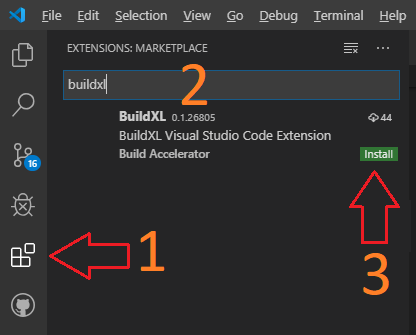

# Installing BuildXL

## Build Engine
Prebuilt binaries for BuildXL are only distributed internally within Microsoft. Externally you'll need to build the project locally from the main branch of its repo. See the [Developer Guide](DeveloperGuide.md) for instructions.

## DScript [Visual Studio Code](https://code.visualstudio.com) Plug-in

### Windows
You can find the plugin in the marketplace under "BuildXL". It should be recommended for our repo.

The steps to take are:



### MacOS
The plugin only contains windows binaries at the moment. For MacOS we currently only support building the plugin locally. You can build the plugin using a local copy of the BuildXL repo with:

1. `bxl out\bin\debug\ide\*`
1. Launch VsCode
1. Type 'Ctrl'+'Shift'+'P' (or choose 'View -> Command Palette...' from the main menu)
1. Type `vsix`

     
1. Select 'Extensions: Install from VSIX
1. Navigate to: `<YourEnlistmentRoot>\Out\Bin\debug\ide` to install the extension you just built locally 
1. Select `BuildXL.vscode.osx.vsix`
1. Open a `.dsc` file to see the extension in action
1. **[macOS only]** The first time you open a `.dsc` file after installing the extension you might get the following error message

The most likely reason for this is the `BuildXL.Ide.LanguageServer` file from the extension deployment missing Execute permission.  To fix it, locate that file in your `~/.vscode/extensions` directory and execute `chmod +x` on it, e.g.,
    ```bash
    chmod +x ~/.vscode/extensions/microsoft.buildxl.dscript-0.1.0-devBuild/bin/BuildXL.Ide.LanguageServer
    ```

## Visual Studio Plugin for opening generated solutions
This plugin enables C# and C++ target language support for building using BuildXL in Visual Studio. It is meant to be used in conjunction with the command line `bxl -vs` command that generates .g.csproj and .g.vcxproj files from DScript build specs.

### Acquire the plugin
You can build it locally with this command: `bxl out\bin\debug\ide\*`. And find the resulting file will be dropped at: `out\bin\debug\ide\BuildXL.vs.vsix`. You can install it by simply running the vsix.

If you see a message like this: `The application which this project type is based on was not found. Please try this link for further information: http://go.microsoft.com/fwlink/?LinkID=299083&projecttype=DABA23A1-650F-4EAB-AC72-A2AF90E10E37` then you need to build and install the plugin. This is the plugin's GUID which is referenced from the generated proj files from `bxl -vs`.

## macOS Sandbox Kernel Extension
### Locating the kernel extension binaries
1. If you are using an APEX office enlistment, this will be a location like: `[enlistmentRoot]/build/NugetCache/BuildXL.osx-x64.*` 
1. Within the BuildXL nuget package, locate the kernel extension. It is under `[BuildXLPackageRoot]/native/MacOS/BuildXLSandbox.kext`

### Loading the kernel extension

#### Option 1: Perform all steps manually
1. Create a new destination directory on your Mac and copy `BuildXLSandbox.kext/` (which is a directory) underneath the newly created destination. This destination directory can be underneath home (a.k.a. "~"), but it **cannot** be the home directory itself due to permissions issues.  For example:
`mkdir -p /tmp`
`cp -r "$BuildXLPackageRoot/native/MacOS/BuildXLSandbox.kext" /tmp/`
1.  Change ownership and apply permissions for the newly created directory:
`sudo chown -R root:wheel /tmp/BuildXLSandbox.kext`
`sudo chmod -R 555 /tmp/BuildXLSandbox.kext`
1. Start the KEXT.
`sudo kextutil /tmp/BuildXLSandbox.kext`
1. Verify that the KEXT is running. If you run
`kextstat | grep buildxl`
the output should look something like
` 132    0 0xffffff7f80cea000 0x68000    0x68000    com.microsoft.buildxl.sandbox (1.57.99) C1BBFFEF-A3AA-3457-A159-340CC5BA84E2 <5 4 3 2 1>`

#### Option 2: Run the `sandbox-load.sh` script
The `sandbox-load.sh` script (found next to the `bxl` executable) automates the steps outlined above in a bit more robust way.
```
sudo ./sandbox-load.sh --deploy-dir /tmp --kext native/MacOS/BuildXLSandbox.kext
```
This command copies the supplied folder to `/tmp/BuildXLSandbox.kext`, applies the required permissions to it and loads the extension from there.  If `/tmp/BuildXLSandbox.kext` already exists, it deletes it.  If the kernel extension is already running, it unloads the running extension before attempting to load the new one.

For more information about the `sandbox-load.sh` script execute `./sandbox-load.sh --help` or see its [man page](/BuildXL/Reference-Guide/Man-Pages/sandbox%2Dload.sh.1).

#### Option 3: Pass the `--load-kext` switch to `bxl.sh`
If `--load-kext` is passed to the `bxl.sh` script (found next to the `bxl` executable), before running BuildXL the script will load the kernel extension that is pre-packaged with that BuildXL deployment.  
```
./bxl.sh --load-kext [other-bxl-args-for-running-buildxl]
```
This script simply invokes the previously described `sandbox-load.sh` script using `/tmp` as the deployment destination directory.

For more information about the `bxl.sh` script execute `./bxl.sh --help` or see its [man page](/BuildXL/Reference-Guide/Man-Pages/bxl.sh.1).

### *Important notes*
- **Note 1:** If this is the first time you've attempted to load the BuildXL KEXT, you'll need to allow it in System Preferences -> Security & Privacy. You should see a notification about loading software from Microsoft. <br>
- **Note 2:** The allow button can only be hit by a mouse directly connected to the Mac. Remoting in will not work.
- **Note 3:** You may need to restart the KEXT each time you restart your machine

For further information check Apple TechNotes:
- https://developer.apple.com/library/archive/technotes/tn2459/_index.html
- https://developer.apple.com/library/archive/documentation/Darwin/Conceptual/KEXTConcept/KEXTConceptKEXT/kext_tutorial.html#//apple_ref/doc/uid/20002365-BABJHCJA
