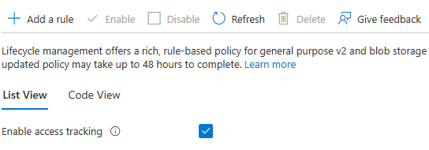

# Configuring a shared cache backed by an Azure Blob Storage Account

An Azure Storage Blob account can be used to host a shared cache for BuildXL builds. Any running BuildXL instance that has access to the blob storage account (and has the proper credentials) can store and retrieve information from the shared cache. If you are interested in knowing more details about the cache and its multi-tier architecture, check [here](../../Public/Src/Cache/Readme.md).

**Caution!** There are security implications to utilizing a shared cache that lives across build invocations. Be careful to control access to the backing cache and be intentional about which builds are trusted to publish data into the cache.

In this section we will explain how to create an Azure Storage Blob account that can host a BuildXL cache and how to configure BuildXL to use it.

## Creating a storage account
Please follow the Azure [instructions](https://learn.microsoft.com/en-us/azure/storage/common/storage-account-overview) to create an account. Both a standard or premium account can host a BuildXL cache, but there are some considerations:
* A premium account has lower latency and a higher throttling limit. Depending on the load of your builds, using one or the other can make a difference in end to end build time. The cost is also higher. Please check Azure blob storage SLAs for details.
* If you decide to use a premium storage account, please pick a **block blob storage** one, which is optimized for the type of operations the BuildXL cache will perform.
* If your build is running in Azure, create the storage account in the same Azure region as your agent pool to maximize performance.

After your account is created, the recommendation is to configure a [lifecycle management policy](https://learn.microsoft.com/en-us/azure/storage/blobs/lifecycle-management-policy-configure?tabs=azure-portal) so the cache does not grow indefinitely. The overall retention policy to configure will depend on the type of builds and frequency of your scenarios. Cost is also a consideration, as billing includes used capacity, and a higher retention policy will incur in a high cost. An initial value can be around 3 or 4 days, but experimenting with this based on your particular scenarios is highly recommended.

The first step is turning on `access tracking`. This enables setting lifecycle management rules that are based on `last access time`:



The cache stores two type of information: metadata (e.g. pip fingerprints) and content (e.g. output files). In order to avoid unnecesary cache lookups that will end up in misses, two management rules should be created, so metadata will be evicted slighly faster than content. Let's assume we want to define an eviction policy so content that is not used in 4 days will be evicted. We will create two lifecycle management rules for that, one for metadata and one for content:


When creating the rules, select `Limit blobs with filters` and configure the `metadata-garbage-collection` rule such that if base blobs are `last accessed` more than `4` days ago, then `delete the blob`:


And then configure a filter by setting the `blob prefix` to be `metadata`:


Now for the content rule. As mentioned above, we want content to be evicted with a slightly lower cadence, so we avoid the extra time it takes for a cache lookup to find a fingerprint but realize later that the corresponding content has been evicted. Therefore, we will set the base blobs to be deleted after not being accessed for `5` days.


And we will set a filter by setting `blob prefix` to be `content`:


## Configuring BuildXL to use a Blob-based shared cache

A cache configuration file should be provided to BuildXL so a blob-based cache is used. Here is an example that sets a local cache together with a remote blob-based cache:

```json
{
  "RemoteIsReadOnly": false,
  "SkipDeterminismRecovery": true,
  "WriteThroughCasData": true,
  "FailIfRemoteFails": true,
  "RemoteConstructionTimeoutMilliseconds": 30000,
  "Assembly": "BuildXL.Cache.VerticalAggregator",
  "Type": "BuildXL.Cache.VerticalAggregator.VerticalCacheAggregatorFactory",
  "RemoteCache": {
    "Assembly": "BuildXL.Cache.MemoizationStoreAdapter",
    "CacheLogPath": "[BuildXLSelectedLogPath].Remote.log",
    "Type": "BuildXL.Cache.MemoizationStoreAdapter.BlobCacheFactory",
    "CacheId": "remoteexamplecache",
    "Universe": "exampleuniverse",
    "RetentionPolicyInDays": 4
  },
  "LocalCache": {
    "MaxCacheSizeInMB": 40480,
    "Assembly": "BuildXL.Cache.MemoizationStoreAdapter",
    "Type": "BuildXL.Cache.MemoizationStoreAdapter.MemoizationStoreCacheFactory",
    "CacheLogPath": "[BuildXLSelectedLogPath]",
    "CacheRootPath": "[BuildXLSelectedRootPath]",
    "CacheId": "localexamplecache"
  }
}
```

The relevant fields for the `RemoteCache` sections are:
* The `Type`, which tells BuildXL this is a blob-based cache.
* The `CacheId`, used for logging/error reporting to identify the cache in question.
* The `Universe`, which defines the cache universe: builds sharing the same cache universe can actually interchange information.
* The `RetentionPolicyInDays`. This is the retention policy configured in the section above. In the example, we created two rules which define 4 days of retention for metadata and 5 for content. It is important to set the **lowest** value here. It is also important to keep this value in sync with the management policies of the blob account, if they were to be changed. A blob retention policy lower than the value specified here can cause build failures.

The cache configuration file can then be passed to BuildXL via command line arguments:

`bxl.exe /cacheConfigFilePath:<path to the cache config file>`

Finally, the proper credentials need to be provided in order for the BuildXL cache to store and retrieve content from the blob storage account. The environment variable `BlobCacheFactoryConnectionString` has to be set in the context of the running BuildXL instance containing the connection string for the blob storage account. Please check [here](https://learn.microsoft.com/en-us/azure/storage/common/storage-configure-connection-string) for details. If you are running your build in an Azure pipeline, the recommendation is to securely store the environment variable containing the connection string in an [Azure Key Vault](https://learn.microsoft.com/en-us/azure/key-vault/general/overview) and allow your pipeline to consume it.